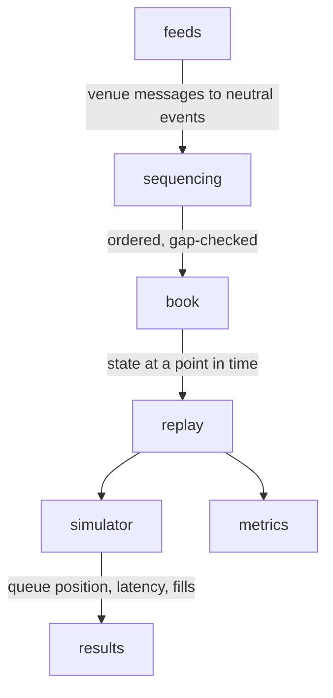

# orderbook-sim

[](https://github.com/FinnTech3/orderbook-sim/actions/workflows/ci.yml)

Rebuilds what an exchange's order book looked like at any moment in the past,
then lets you test whether an order you *would* have placed would actually have
been filled.

## What this is

Exchanges do not publish a picture of their order book. They publish one
snapshot and then a firehose of small changes — "there are now 300 lots bid at
99.85 instead of 500" — and it is up to you to keep your own copy in step. Miss
a single message and your copy is wrong from then on, silently, with nothing to
tell you.

This does that bookkeeping and refuses to guess. It holds updates until it has a
snapshot they can be anchored to, notices immediately if a message goes missing,
and rebuilds from scratch rather than carrying on with a book it cannot vouch
for.

The second half is the part I actually care about. Once you can replay the book,
you can ask what would have happened to an order you never placed. That question
is harder than it looks, and most backtests answer it far too generously.

Here is the problem in one paragraph. The feed tells you the size at a price
fell from 500 to 300. It does not tell you why. If 200 lots *traded*, they were
taken from the front of the queue, and an order sitting near the front would
have been filled. If 200 lots were *cancelled*, they could have been anywhere —
in front of your order, in which case you moved up 200 places, or behind it, in
which case you did not move at all. The data cannot tell these apart. Every
backtest has to assume something, and the assumption is usually invisible and
usually flattering.

So this makes the assumption explicit and runs the same data under all of them:

```
queue model      quotes   filled  pulled  fill rate
---------------------------------------------------
pessimistic        1056     2437     855     23.1%
proportional       1056     2455     853     23.2%
optimistic         1061     2657     840     25.0%
```

Same market data, same strategy, same code. The only thing that changes is what
you believe about where cancellations sat in the queue. Two percentage points of
fill rate sits between the assumptions, and no amount of data closes the gap.

## Why I built it

I study economics and finance, and I kept reading strategy write-ups that
reported a fill rate to two decimal places without ever saying what they assumed
about queue position. That bothered me, because in a lot of those results the
assumption is doing more work than the strategy.

I wanted to know how much difference it actually makes, and the only way to find
out was to build the thing and measure it. For a passive quoting strategy the
answer is a couple of points of fill rate — small enough to look like noise,
large enough to flip a marginal strategy from profitable to not.

## Using it

```sh
git clone https://github.com/FinnTech3/orderbook-sim
cd orderbook-sim
pip install -e ".[dev]"
```

Reconstruct a stream and describe the book it produces:

```sh
obsim demo --events 20000
```

```
Reconstructed 20000 events from seed 1

  best bid      10013
  best ask      10014
  spread        1 ticks
  spread (bps)  1.00
  mid           10013.5
  microprice    10013.784
  imbalance(5)  +0.146
  slip to buy   0.970 ticks

  bid levels    9
  ask levels    10

  matches the venue's own book: yes
```

That last line is the one that matters. The synthetic venue keeps its own copy
of the truth, so the demo checks the reconstruction against it rather than just
checking that it looks plausible.

Run one strategy under every queue assumption:

```sh
obsim sweep --events 40000
```

Measure throughput:

```sh
obsim bench --events 200000
```

```
  events        200,000
  elapsed       0.531 s
  rate          376,646 events/sec
  per event     2.66 us
```

Run the tests:

```sh
pytest          # 110 tests
```

## How it works

Six layers, each depending only on the one above it. The book knows nothing
about any particular exchange, and the simulator knows nothing about websockets.



**Prices are integers, never floats.** Decimal prices convert once, at the feed
boundary, into whole counts of the instrument's tick size. Price levels are
dictionary keys and get compared for equality constantly, and with floating
point you eventually get two "identical" prices that do not compare equal and a
book that quietly grows a level which should not exist. A value that is not on
the tick grid raises instead of rounding, because it means either the instrument
is configured wrongly or the venue changed its tick size, and both are worth
stopping for.

**Sequencing is a state machine with pluggable venue rules.** The states are
disconnected, buffering, and synced, and any detected gap sends it back to
buffering. While buffering, updates are queued rather than applied. When a
snapshot arrives, updates it already accounts for are discarded, the single
update straddling the snapshot is identified, and the rest are applied in order.
If the earliest held update starts *after* the snapshot ends, messages were lost
in between and no replay can recover them, so that snapshot is rejected and a
newer one requested.

Venues disagree on how they express continuity. Binance spot expects you to
infer it from ID adjacency; the futures feed names the previous message's ID
outright. That difference lives in a `SequenceRule` implementation rather than
in the state machine, and the explicit-predecessor rule catches a dropped
message that adjacency would wave through.

**Queue position is tracked as two numbers**: how much size sits ahead of the
order and how much behind. Every event reconciles both against what the venue
reports. Trades consume from the front, new size joins the back, and whatever
shrinkage is left over is cancellation for the model to place.

## Decisions and trade-offs

### The level container is a dictionary plus a sorted array

The book needs O(1) size lookup at a price, fast access to the best price, and
ordered iteration for depth queries. I keep a `dict` of prices to sizes
alongside a `list` of occupied prices held in order with `bisect`.

The obvious objection is that inserting into that list is O(n), because the tail
has to move. I chose it anyway, reasoning that depth updates cluster near the
top of the book, so the tail being moved is short and the move is one vectorised
block copy rather than n interpreted steps.

Then I benchmarked it instead of trusting that reasoning. 200,000 updates with
two best-price reads each:

| container | 10 levels | 50 levels | 500 levels |
| --- | --- | --- | --- |
| dict + bisect (chosen) | 0.151 s | 0.160 s | 0.151 s |
| dict + sort on read | 0.230 s | 0.339 s | 0.327 s |
| dict + lazy heap | 0.188 s | 0.180 s | 0.185 s |
| dict + `list.sort()` | 0.157 s | 0.157 s | 0.160 s |

Sorting on every read costs 1.5x to 2.2x and gets worse as the book deepens,
which is what you would expect. The lazy heap has the better complexity class
and loses by about 20% on constants, because the stale entries it accumulates
have to be skipped on every read.

The result I did not expect is the last row. Appending and calling `list.sort()`
is as fast as `bisect`, within noise, at every depth I tried. Timsort notices
the list is already nearly sorted and does almost nothing, and the clustering
that makes `bisect` cheap is the same clustering that makes the sort cheap. My
container wins, but by a margin small enough that I would not defend it on
performance alone. I kept it because maintaining the ordering invariant on every
write is easier to reason about than depending on a sort staying adaptive, not
because it is meaningfully faster.

### The queue split is bounded by arithmetic, not only by the assumption

I got this wrong first time and it is worth writing down.

My first version had the pessimistic model return zero: no cancellation ever
comes from in front of you. But an order that has just joined the back of a
500-lot level has all 500 in front of it and nothing behind. If 200 then cancel,
all 200 came from in front, whatever I would have preferred to assume. Returning
zero left the order believing 500 lots were ahead of it on a level that now held
300 — not a pessimistic estimate, an impossible one.

Each model now expresses a *preference*, and a `clamp` forces that preference
into the range the sizes actually allow. This is why the simulator tracks size
behind the order as well as ahead: without both numbers there is no way to know
which preferences are even available.

### Pessimistic placement is the default

Three models ship: cancellations come from behind you, from in front of you, or
spread evenly across the queue. The default assumes behind, so orders move up as
little as the arithmetic permits.

A simulator wrong in that direction understates its fills, which is the
survivable way to be wrong. Wrong in the other direction produces a backtest
promising fills the market would never have given you.

The right way to use this is not to pick one, though. It is to run all three and
quote the range, which is what `obsim sweep` does.

### Our order was never really there

The order being simulated did not exist at the venue, so every size in the feed
belongs to other participants. On arrival it joins the back of whatever queue
the feed shows. This also means a print at a price better than ours implies a
fill: if our bid had genuinely been resting there, the aggressor would have
reached us before reaching the price that actually printed.

### Two separate latencies

Feed latency (venue publishes, we see it) and order latency (we decide, venue
acts) are modelled independently, because they are different physical paths and
are often asymmetric. The strategy acts on a book that has already moved, and
its orders land in a book that has moved again. There is a test showing the same
strategy filling 10 lots with zero latency and none at all with five microseconds
of it.

### Gaps abandon resting orders

When the feed loses sync the book is rebuilt from a fresh snapshot, and there is
no way to know what happened to the queue in between. Carrying the old positions
across would be inventing information, so resting orders are dropped and
counted. A live system would reconcile against the venue's own view at this
point. A backtest cannot, and should not pretend to.

## Testing

110 tests, in three kinds.

**Differential.** The level container is checked against a deliberately naive
implementation that sorts on every read, over 20,000 random operations. They
must agree exactly. This is the test I trust most: it is easy to write a fast
data structure that is subtly wrong, and comparing it against an obviously
correct slow one catches what unit tests miss.

**Ground truth.** The synthetic venue keeps the true book beside the stream it
emits, so tests can assert that replaying the messages reproduces that book
level for level, rather than merely that reconstruction is self-consistent. This
covers joining mid-stream, buffering while a snapshot request is in flight,
dropped messages and recovery, and duplicate delivery.

**Property-based.** Hypothesis generates arbitrary streams and checks the
invariants: the book never crosses, sizes are never negative, the dictionary and
the sorted array always agree, and no queue model returns a split the sizes
cannot support.

The property tests earned their place on the first run by finding a bug I would
not have found by hand. A trade against a single lot resting on the only level
of a side cleared that side entirely, because the fill size was clamped with
`max(1, resting - 1)`, which still takes everything when `resting` is 1. It is
pinned now by a regression test that builds the state directly rather than
hoping a seed rediscovers it.

## What I would do differently

**No market impact.** Taking liquidity does not move the book, and our order
does not change what anyone else does. That holds while the simulated size is
small next to displayed depth and breaks badly when it is not. Modelling even
crude impact would make the sweep numbers meaningfully more honest, and it is
the first thing I would add.

**The synthetic venue is not a market.** It has no drift, no volatility
clustering, no relationship between trades and the depth changes that follow
them, and its participants have no strategy. It is good enough to prove
reconstruction is correct, which is what I built it for, but the fill rates it
produces are a property of the generator and should not be read as an estimate
of anything. Running against recorded exchange data is the obvious next step.

**One instrument, level 2 only.** No cross-instrument state, and no level 3.
With per-order data the queue ambiguity that motivates this whole project mostly
disappears, and it would be worth running both to measure how far the L2 models
land from the L3 answer.

**Sizes are counted in lots throughout.** Right for futures, awkward for
instruments quoted in notional.

**Order latency is a constant.** Real latency has a distribution with a long
right tail, and the tail is where the interesting failures live.

## License

MIT. Original work — see [docs/SOURCES.md](docs/SOURCES.md).
